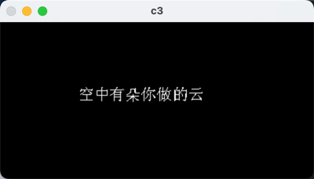
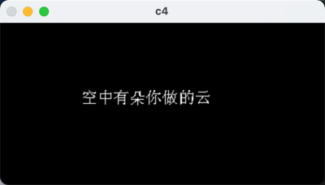

# opencv-put-chinese

## summarize

With the help of freetype, implement the method of printing Chinese text on pictures using opencv, support 3-channel and 4-channel pictures。

## libs

In the project, only the Dylib library used by the Arm64-based MAC is used, and other systems or architectures need to compile their own dependent libraries

- freetype 6.20.1
- opencv 4.9

## usetage

The program can be executed directly, and the main.cpp examples of 3-channel printing and 4-channel printing code are exemplified

The specific code is as follows

```c++
std::string fontPath = "../SimSun.ttf";
cvx::CvxFont font(fontPath);

cv::Mat c3_img(200, 400, CV_8UC3, cv::Scalar(0, 0, 0));
cvx::putText(c3_img, "空中有朵你做的云", cv::Point(100, 100), font, 20, cv::Scalar(255, 255, 255));
cv::imshow("c3", c3_img);
cv::waitKey(0);

cv::Mat c4_img(200, 400, CV_8UC4, cv::Scalar(0, 0, 0));
cvx::putText(c4_img, "空中有朵你做的云", cv::Point(100, 100), font, 20, cv::Scalar(255, 255, 255));
cv::imshow("c4", c4_img);
cv::waitKey(0);
```

## screenshots

- 3-channel



- 4-channel

